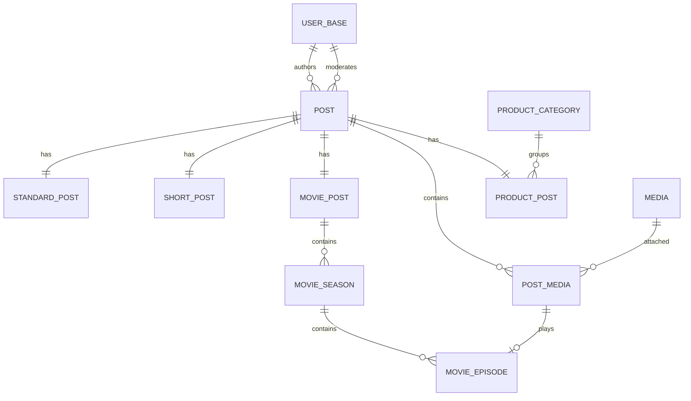

# Hướng Dẫn Tự Code Backend Cho Post

## 1. Mục Tiêu

Tài liệu này hướng dẫn tự code backend cho feature post theo từng checkpoint.
Nó không cung cấp một implementation hoàn chỉnh để sao chép. Thay vào đó,
tài liệu chốt:

- Model và quan hệ cần có.
- Business invariant bắt buộc.
- Transaction boundary.
- Repository contract và query pattern.
- Cách tránh N+1.
- Security boundary.
- Checklist để tự đối chiếu sau mỗi bước.

Hãy làm `STANDARD` post trước. Chỉ trừu tượng hóa khi `STANDARD` và `SHORT`
đã cùng hoạt động, vì lúc đó mới có đủ hai implementation để nhìn ra phần
thực sự dùng chung.

## 2. Phạm Vi Ban Đầu

Đợt đầu tiên chỉ cần hoàn thành:

1. Common post kernel.
2. Standard post.
3. Media attachment.
4. Moderation.
5. Public feed.
6. Owner post listing.

Chưa làm trong đợt đầu:

- Comment.
- Chỉnh sửa hoặc gửi duyệt lại published post.
- Like, reaction, follow và friend.
- Personalized feed.
- Movie, product, wiki và blog detail.
- UI.

## 3. Business Rules Không Được Phá Vỡ

- Mỗi post có một `PostEntity` root.
- Post mới luôn bắt đầu bằng `PENDING_REVIEW`.
- Chỉ có hai transition:
  - `PENDING_REVIEW -> PUBLISHED`
  - `PENDING_REVIEW -> REJECTED`
- `publishedAt` chỉ được set khi moderator publish.
- Public query chỉ được trả `PUBLISHED`.
- Pending và rejected chỉ hiển thị cho owner hoặc moderator.
- Author và moderator ID phải lấy từ authenticated principal, không lấy từ
  request payload.
- Media được gắn vào post phải:
  - Thuộc author.
  - Có `RecordStatus.ACTIVE`.
  - Có `MediaProcessingStatus.READY`.
- Public result không được lộ storage key, rejection reason hoặc internal
  moderation metadata.
- Nội dung do người dùng tạo không được tự động dịch.

## 4. Package Structure

Bắt đầu với structure sau:

```text
features/post
|-- api/v1/controller
|-- entity
|-- enums
|-- repository
|   `-- spec
|-- schema
|   |-- filter
|   |-- model
|   |-- payload
|   `-- result
|-- service
|   `-- impl
`-- validation
```

Không tạo folder `factory` hoặc `handler` trong đợt đầu. Chúng chỉ nên xuất
hiện sau khi đã có `STANDARD` và `SHORT`.

## 5. Model Tổng Quan



## 6. Enum Blueprint

Tạo enums trong `features/post/enums`.

```java
public enum PostType {
    STANDARD,
    SHORT,
    VIDEO,
    PRODUCT,
    WIKI,
    BLOG
}
```

```java
public enum PostModerationStatus {
    PENDING_REVIEW,
    PUBLISHED,
    REJECTED
}
```

```java
public enum PostMediaRole {
    COVER,
    CONTENT,
    GALLERY,
    TRAILER,
    EPISODE,
    SOURCE
}
```

Không thêm `DRAFT`, `DELETED` hoặc `ARCHIVED` nếu business chưa có flow cho
chúng.

## 7. Common Entity Blueprint

### 7.1 PostEntity

`PostEntity` chỉ chứa state chung của mọi loại post:

```java
UUID id;
UserBaseEntity author;
PostType type;
PostModerationStatus moderationStatus;
LocalDateTime publishedAt;
UserBaseEntity moderatedBy;
LocalDateTime moderatedAt;
String rejectionReason;
```

Entity kế thừa `BaseAuditEntity`.

Mapping cần chú ý:

- `author`: `ManyToOne`, lazy, non-null.
- `moderatedBy`: `ManyToOne`, lazy, nullable.
- `type`: named enum, non-null.
- `moderationStatus`: named enum, non-null.
- `publishedAt`, `moderatedAt`, `rejectionReason`: nullable.
- `rejectionReason`: giới hạn khoảng 1000 ký tự.

Không đưa `title`, `body`, `price`, `duration` hoặc các field đặc thù vào
`PostEntity`.

### 7.2 StandardPostEntity

Sử dụng shared primary key:

```java
UUID postId;
PostEntity post;
String content;
```

Mapping:

```java
@Id
private UUID postId;

@MapsId
@OneToOne(fetch = FetchType.LAZY, optional = false)
@JoinColumn(name = "post_id", nullable = false)
private PostEntity post;
```

Không dùng `@GeneratedValue` cho `postId`. ID này lấy từ `PostEntity`.

`content` dùng SQL `TEXT`. Content có thể null nếu post chỉ chứa media.

### 7.3 PostMediaEntity

```java
UUID id;
PostEntity post;
MediaEntity media;
PostMediaRole role;
int position;
```

Business invariant:

- `position >= 0`.
- Không trùng `(post_id, role, position)`.
- Không gắn cùng một media hai lần vào cùng post.
- Position được tính theo thứ tự `mediaIds` trong payload.

`EPISODE` vẫn nằm trong `post_media`. Sau này `MovieEpisodeEntity` sẽ tham
chiếu một `PostMediaEntity` có role `EPISODE`, thay vì tạo thêm một quan hệ
media song song.

## 8. Migration

Từ thời điểm này database đã có khả năng được deploy, vì vậy không sửa lại
V1/V2 cho post. Tạo migration mới:

```text
V3__post_schema.sql
V4__post_data.sql
```

`V3` chứa:

- Enum types.
- `post`.
- `standard_post`.
- `post_media`.
- Foreign keys.
- Unique constraints.
- Indexes.

`V4` chứa:

- Permission `POST:CREATE`.
- Permission `POST:VIEW:OWN`.
- Permission `POST:MODERATE`.
- Gán `POST:CREATE` và `POST:VIEW:OWN` cho role `USER`.
- Gán tất cả post permissions cho `SUPER_ADMIN`.

Không seed post mẫu.

### Index Tối Thiểu

```text
post(moderation_status, published_at)
post(author_id, moderation_status, created_at)
post_media(post_id, role, position)
post_media(media_id)
```

Unique indexes:

```text
post_media(post_id, role, position)
post_media(post_id, media_id)
```

Chưa cần thêm:

- Index riêng cho `created_at`.
- Index riêng cho `updated_at`.
- Index cho `moderated_by`.
- Index kết hợp `type` cho đến khi có dữ liệu và query plan thực tế.

## 9. Payload Blueprint

Payload đầu tiên:

```java
@Data
public class CreateStandardPostPayload {

    @Size(max = 10_000)
    private String content;

    @NotNull
    @Size(max = 20)
    private List<@NotNull UUID> mediaIds = List.of();

    @AssertTrue(message = "{validation.post.content.required}")
    public boolean isContentAvailable() {
        return StringUtils.hasText(content)
                || (mediaIds != null && !mediaIds.isEmpty());
    }
}
```

Giới hạn hard safety trong annotation phải lớn hơn hoặc bằng giới hạn config.
Service vẫn cần enforce config business limit, ví dụ:

```yaml
app:
    post:
        standard:
            max-content-length: 5000
            max-media-count: 10
```

Đây là business validation dựa trên config, nên có thể nằm trong service hoặc
custom validator. Không viết lại các null, blank và size check mà Jakarta đã
làm được.

Không đưa các field sau vào payload:

```text
authorId
moderationStatus
publishedAt
moderatedBy
createdAt
```

## 10. Result Model Boundary

Không dùng một result khổng lồ cho public, owner và moderator.

### Public result

Chỉ chứa:

```text
id
type
author: UserShortResult
publishedAt
content
public media URLs
```

### Owner result

Có thể thêm:

```text
moderationStatus
createdAt
updatedAt
rejectionReason
```

### Moderator detail result

Có thể thêm:

```text
original media inspection data
moderation metadata
author information
```

Public result không được tái sử dụng từ moderator result bằng cách "ẩn bớt
field" trên template. Boundary phải được giữ ngay từ service và result model.

## 11. Repository Contract

### PostRepository

```java
public interface PostRepository
        extends JpaRepository<PostEntity, UUID>,
                JpaSpecificationExecutor<PostEntity> {
}
```

Thêm một hàm lock theo ID cho moderation:

```java
@Lock(LockModeType.PESSIMISTIC_WRITE)
Optional<PostEntity> findOneById(UUID postId);
```

### PostMediaRepository

General listing không được return `List`, nhưng bulk load attachments của một
page post là bounded domain read và được phép:

```java
@EntityGraph(attributePaths = PostMediaEntity_.MEDIA)
List<PostMediaEntity> findAllByPost_IdInOrderByPost_IdAscPositionAsc(
        Collection<UUID> postIds);
```

Khi validate caller-supplied media IDs, một bounded `List<MediaEntity>` cũng
được phép. Không dùng hàm đó để triển khai media library listing.

## 12. Transaction Tạo Standard Post

Method contract gợi ý:

```java
UUID createStandardPost(
        UUID authorId,
        CreateStandardPostPayload payload);
```

Method phải có `@Transactional`.

Thứ tự xử lý:

1. Load và lock active author.
2. Normalize content:
   - Trim outer whitespace.
   - Không phá line break bên trong.
3. Loại media ID trùng nhau nhưng vẫn giữ thứ tự đầu vào.
4. Enforce configured content/media limits.
5. Load media bằng một bounded query.
6. Xác nhận số record load được bằng số ID đầu vào.
7. Xác nhận owner, `ACTIVE`, `READY`.
8. Tạo `PostEntity`:
   - `type = STANDARD`.
   - `moderationStatus = PENDING_REVIEW`.
   - `publishedAt = null`.
9. Tạo `StandardPostEntity`.
10. Tạo `PostMediaEntity` theo thứ tự payload.
11. Trả về post ID hoặc owner-safe result.

Không enqueue JobRunr. Media đã phải `READY` trước khi được gắn.

### Lock Order

Giữ lock order ổn định:

```text
author -> media sorted by UUID -> post
```

Khi query nhiều media để lock, repository phải dùng `PESSIMISTIC_WRITE` và
`ORDER BY media.id`. Chỉ sort danh sách UUID trong Java là chưa đủ, vì SQL
`IN` không đảm bảo thứ tự row:

```java
@Lock(LockModeType.PESSIMISTIC_WRITE)
@Query("""
        SELECT media
        FROM MediaEntity media
        WHERE media.id IN :mediaIds
        ORDER BY media.id
        """)
List<MediaEntity> findAllForPostAttachment(
        @Param("mediaIds") Collection<UUID> mediaIds);
```

Đây là bounded domain query, không phải media library listing.

## 13. Media Validation

Media validation cần phân biệt ở cấp logic nội bộ:

- ID không tồn tại.
- Media không thuộc author.
- Media inactive.
- Media chưa ready.
- Media đang được dùng bởi một flow không cho phép reuse.

Có thể trả một business error chung ra client để không lộ thông tin ownership,
nhưng log vẫn có thể ghi internal reason ở mức phù hợp.

Không map physical fields sau vào post result:

```text
storageKey
thumbnailStorageKey
filesystem path
HLS workspace path
```

## 14. Moderation Service

Method contract:

```java
void publishPost(UUID postId, UUID moderatorId);

void rejectPost(
        UUID postId,
        UUID moderatorId,
        RejectPostPayload payload);
```

Controller lấy `moderatorId` từ principal.

Service:

1. Lock moderator nếu cần validate account state.
2. Lock post bằng `PESSIMISTIC_WRITE`.
3. Chỉ chấp nhận `PENDING_REVIEW`.
4. Khi publish, revalidate toàn bộ attached media vẫn `ACTIVE` và `READY`.
5. Khi publish, set:
   - `moderationStatus = PUBLISHED`.
   - `publishedAt = now`.
   - `moderatedBy = moderator`.
   - `moderatedAt = now`.
   - `rejectionReason = null`.
6. Khi reject:
   - `moderationStatus = REJECTED`.
   - `publishedAt = null`.
   - Set moderator, time và reason.

Hai request publish/reject đồng thời sẽ được serialize bởi row lock. Request
thứ hai phải fail vì post không còn `PENDING_REVIEW`.

Permission:

```java
@Secured("POST:MODERATE")
```

## 15. Filter Boundary

Không tạo một filter khổng lồ dùng cho mọi context.

### PublicPostFilterCriteria

```text
type
authorId
```

Public service tự ép:

```text
moderationStatus = PUBLISHED
```

Không cho client gửi moderation status vào public filter.

### OwnerPostFilterCriteria

```text
type
moderationStatus
```

Owner ID lấy từ principal, không lấy từ filter.

### ModerationPostFilterCriteria

```text
type
authorId
createdFrom
createdTo
```

Moderation queue tự ép:

```text
moderationStatus = PENDING_REVIEW
```

Tách filter như vậy ngăn một lỗi nguy hiểm: user thêm query parameter để lấy
pending/rejected post của người khác.

## 16. Specification

Tạo specification riêng cho post. Dùng JPA static metamodel, không dùng magic
string.

Core predicates:

```text
hasType
hasAuthor
hasModerationStatus
createdBetween
publishedBefore
```

Public service compose security predicate, không để controller tự compose.

Sort mặc định:

```text
Public feed: publishedAt DESC
Owner posts: createdAt DESC
Moderation queue: createdAt ASC
```

Moderation queue dùng oldest-first để admin xử lý bài đã chờ lâu trước.

## 17. Paging Và N+1

Không `JOIN FETCH` collection attachments trong query có paging. Hibernate có
thể:

- Duplicate root rows.
- Paging trong memory.
- Trả sai page size.

Flow đúng:

1. Query `Page<PostEntity>` và chỉ fetch quan hệ to-one cần thiết.
2. Lấy danh sách post IDs của page.
3. Bulk load toàn bộ `PostMediaEntity` của các IDs đó.
4. Group attachment theo post ID.
5. Map page:

```java
return entityPage.map(post ->
        postAssembler.toPublicResult(
                post,
                mediaByPostId.getOrDefault(
                        post.getId(),
                        List.of())));
```

Không dùng method reference.

Nếu cần full name/avatar của author mà relation hiện tại không map từ
`UserBaseEntity`, bulk load `UserInfoEntity` theo author IDs. Không query
profile theo từng row.

## 18. API Boundary

Public:

```text
GET /api/v1/public/posts
GET /api/v1/public/posts/{postId}
```

Authenticated owner:

```text
POST /api/v1/posts/standard
GET  /api/v1/posts/mine
GET  /api/v1/posts/mine/{postId}
```

Moderator:

```text
GET  /api/v1/admin/posts/review
GET  /api/v1/admin/posts/{postId}
POST /api/v1/admin/posts/{postId}/publish
POST /api/v1/admin/posts/{postId}/reject
```

Public security matcher chỉ mở `GET /api/v1/public/posts/**`. Không được mở
nhầm POST action.

Thymeleaf sau này gọi service trực tiếp, không tự gọi lại API.

## 19. Error Và i18n Keys

Giữ error code ổn định và message key có thể dịch:

```text
POST_NOT_FOUND
POST_STATE_INVALID
POST_MEDIA_INVALID
POST_MEDIA_NOT_READY
POST_MODERATION_INVALID
```

Message keys gợi ý:

```text
error.post.notFound
error.post.stateInvalid
error.post.mediaInvalid
error.post.mediaNotReady
error.post.moderationInvalid
validation.post.content.required
validation.post.content.tooLong
validation.post.media.tooMany
```

System log vẫn dùng English. Nội dung của user không dịch.

## 20. Checkpoint 1: Kernel Compile

Hoàn thành khi:

- V3 migration tạo được enums và ba table.
- Entity metamodel được generate.
- Quan hệ `@MapsId` compile.
- Không có sample data.
- JPA indexes khớp migration.

Chưa cần controller và service.

## 21. Checkpoint 2: Standard Post Creation

Hoàn thành khi:

- Text-only post tạo được.
- Media-only post tạo được.
- Payload rỗng bị reject.
- Media của user khác bị reject.
- Pending media bị reject.
- Post mới luôn `PENDING_REVIEW`.
- `publishedAt` vẫn null.
- Media order được giữ.

## 22. Checkpoint 3: Moderation

Hoàn thành khi:

- Pending post publish được một lần.
- Pending post reject được một lần.
- Published/rejected post không transition tiếp.
- Publish set `publishedAt`.
- Reject lưu reason.
- Hai moderation request đồng thời chỉ có một request thành công.

## 23. Checkpoint 4: Public Feed

Hoàn thành khi:

- Anonymous xem được published post.
- Pending/rejected không lọt ra public query.
- Filter type không thay đổi security predicate.
- Paging metadata đúng.
- Không có N+1 cho author, profile và attachments.
- Không lộ physical media key.

## 24. Checkpoint 5: Short Post

Sau khi standard post ổn định, thêm:

```text
ShortPostEntity(post_id, caption)
CreateShortPostPayload
ShortPostResult
ShortPostService
```

Short policy có thể config:

```text
max caption length
max media count
allowed media kinds
max duration
allowed aspect ratio
```

Chỉ sau checkpoint này mới rút ra:

```java
public interface PostTypeHandler<P> {

    PostType getType();

    void createDetail(
            PostEntity post,
            P payload);
}
```

Registry được key bằng `PostType`. Không tạo abstract factory hierarchy.

Registry là infrastructure nội bộ. Dedicated payload và endpoint của từng loại
post vẫn được giữ.

## 25. Model Blueprint Cho Các Type Sau

### Movie

```text
movie_post(
    post_id,
    title,
    description
)

movie_season(
    id,
    post_id,
    season_number,
    title,
    position
)

movie_episode(
    id,
    season_id,
    post_media_id,
    episode_number,
    title,
    description,
    position
)
```

Movie không có season vẫn tạo một implicit season. Như vậy episode không cần
nullable `season_id`.

Playback progress chỉ lưu trong browser `localStorage`, không thêm table.

### Product

```text
product_post(
    post_id,
    category_id,
    title,
    description,
    price,
    currency
)
```

Flexible filterable attributes dùng relational model:

```text
product_attribute_definition
product_attribute_option
product_attribute_value
```

Definition chứa:

```text
key
label
value_type
unit
filterable
status
```

Value dùng typed columns:

```text
text_value
number_value
boolean_value
option_id
```

Service đảm bảo chỉ dùng đúng một typed value theo definition type.

Không dùng JSON cho field cần filter.

### Wiki

```text
wiki_post(
    post_id,
    title,
    summary,
    source_post_media_id
)
```

Source attachment có role `SOURCE` và phải là Markdown document. Rendered HTML
phải được sanitize trước khi trả ra UI.

### Blog

```text
blog_post(
    post_id,
    title,
    summary,
    body_markdown
)
```

Cover dùng `PostMediaRole.COVER`. Body Markdown lưu bằng `TEXT`, không cần JSON.

## 26. Các Pitfall Cần Tự Review

- Dùng JPA entity inheritance cho post type.
- Một table post có hàng chục nullable columns.
- Một generic JSON payload cho mọi post type.
- Cho payload truyền author hoặc moderation state.
- Public filter nhận moderation status.
- Fetch collection trong pageable query.
- Query profile/media theo từng row.
- Gắn media chưa `READY`.
- Tin content type từ request thay vì media record đã validate.
- Hard-code physical media path vào result.
- Publish post mà không revalidate media.
- Thêm `DRAFT`, edit, delete, resubmit khi business chưa yêu cầu.
- Trừu tượng hóa handler trước khi có short post.
- Tạo index cho mọi audit column.

## 27. Definition Of Done Cho Backend Post Kernel

Post kernel được xem là ổn định khi:

- Standard post create flow transactional.
- Media ownership và readiness được enforce.
- Moderation transition atomic.
- Public feed chỉ trả published data.
- Owner listing không lộ post của người khác.
- Moderator queue oldest-first.
- Paging không fetch collection trực tiếp.
- Result models tách public/owner/moderator.
- V3/V4 migration tách schema và data.
- Error và validation messages có English/Vietnamese keys.
- Static metamodel được dùng trong specification.
- Repository không có native SQL.
- Không có sample post hoặc seed content.

Sau khi đạt checkpoint này, có thể bắt đầu short post và rút ra strategy
registry một cách có đủ căn cứ.
